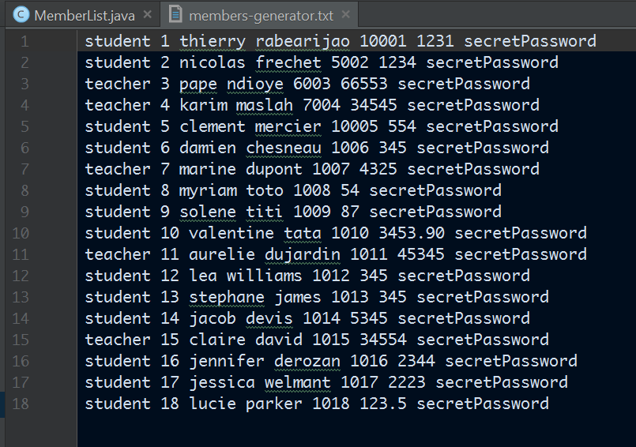
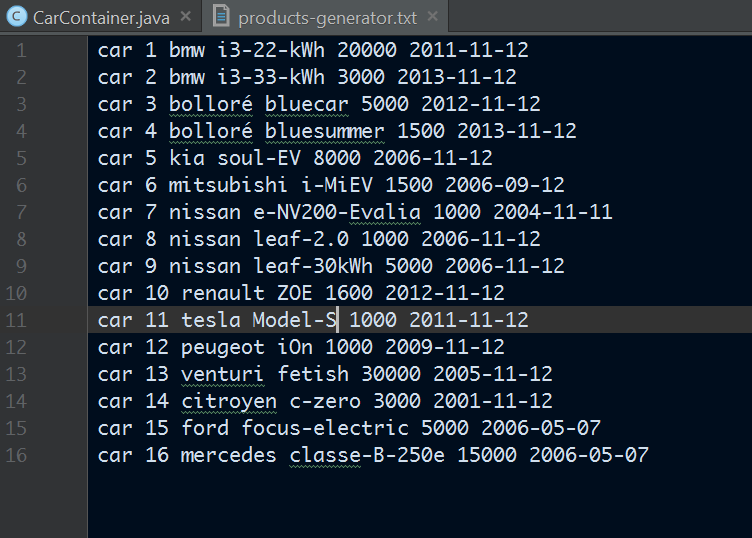

# Introduction

**MLVCarsService** est un projet qui offre un service de partage de véhicules électriques
entre les étudiants et aussi les enseignants de l'Université de Paris-Est Marne-la-Vallée.
Le stockage des véhicules se fait grâce à un serveur RMI ( Remote Method Invocation ), 
cet aspect est l'une des principales particularités de ce projet.

## But du projet

Mise à par l'objectif principal d'offrir le service de partage et aussi de vente de véhicules
entre les membres (étudiants et enseignants) de l'université, le but principal est l'élaboration 
du serveur RMI et de son client qui est en fait l'élément qui offrira le service cité précédemment.
Nous nous sommes aussi donnés comme objectif de réaliser une interface web pour faciliter l'utilisation 
du service.

Le projet est un projet Java basé sur le RMI, tous les appels de méthodes entre le serveur et le client sont 
alors des appels à distance.

# Développement

## Description

MLVCarsService est un projet Java, composé principalement d'un serveur et d'un client.

> Dans tout ce rapport, un _client_ n'est pas un membre, ni l'université mais le composant qui fera les échanges avec le serveur.

Le projet offrira les fonctionnalités suivantes:

- Partage de véhicules:
    - ajout d'un véhicule
	- location d'un véhicule
	- vente d'un véhicule
- Enregistrement d'un nouveau membre
- Changement de devise utilisée par un membre

Ces fonctionnalités seront détaillées dans les parties suivantes.

## Mise en place de l'architecture

Avant de commencer le développement des composants, nous avons débuté par la mise en place de 
l'architecture du projet. 

Dans les titres suivants, nous décrivons comment:
- les modules du projet
- les diagrammes de classes côté serveur

### Quelques petits changements

Nous sommes un peu sortis du sujet au niveau du **webservice bank** que le client devrait contacté 
pour connaître les fonds de chaque membre. Nous avons en fait fait en sorte que chaque membre ait un compte 
banquaire, cet aspect reste au niveau du serveur. Mais le client lui contactera un **service web de conversion 
de devise** afin que chaque membre puisse utiliser la devise qu'il veut: _le but étant que l'application puisse être utilisée 
au niveau international._

### Diagramme des composants du projet

TODO : complete with diagrams, talk about maven - build order

### Le build du projet

Afin de faliciter d'utilisation du projet, nous avons mis en place un build automatique du projet, cela a été simplifié grâce à l'utilisation de **Maven**.

#### Processus de build

Le build s'appuie sur le diagramme de composants ci-dessus. Les modules ( RMIServer, RMIClient, RMIInterface) sont compilés et packagés selon l'ordre suivant:

1. RMIServer
2. RMIInterface
3. RMIClient

##### Build du RMIServer

Durant son build, le module **RMIServer** va créer les fichiers suivants: 

- **car-loan.server.jar** : le jar executable du serveur rmi
- **car-loan.stubs-client.jar** : un jar qui contient toutes les classes **stubs**

##### Build du RMIInterface

Durant son build, le module **RMIInterface** va crééer le fichier suivant : 

- **rmi-interface-_{moduleVersion}_.jar** : le jar qui contient toutes interfaces communes entre le serveur et le client.

##### Build du RMIClient

Durant son build, le module **RMIClient** va créer le fichier suivant: 

- **car-webservice.war**

Afin de réaliser ce build, il passe par les étapes suivantes: 

1. compilation de ses sources
2. récupération du fichier **car-loan.stubs-client.jar** qui a été généré par le serveur
3. récupération du fichier **securityPermissions.policy** venant des ressources du serveur.
4. récupération du fichier **rmi-interface-_{moduleVersion}_.jar** venant du module RMIInteface
5. Packaging de tous ces fichiers dans le **car-webservice.war**

Après se build, **le client rmi possède tout ce qu'il a besoin afin de pouvoir communiquer avec le serveur rmi**.

### Diagrammes de classes

TODO : 

#### RMIServer

D'après les diagrammes ci-dessus, toute l'intélligence de l'application est principalement mise en place du coté du serveur.
Le client lui ne fait qu'invoquer des méthodes et d'afficher à l'utilisateur les résultats de ces invocations.

##### Member

`AbtractMember` est en fait la représentation générale d'un membre de l'université. Il est composé de :

- un ID
- un nom
- un prénom
- un compte banquaire

Il connaît la voiture qu'il est en train de louer.

La différenciation entre un enseignant ( défini par la classe `Teacher` ) et un étudiant ( défini par la classe `Student` )
est leur type ( défini par l'enum `MemberType`). Un enseignant est de type **TEACHER** et un étudiant de type **STUDENT**.

Un membre est aussi un `ProductObserver` afin de mettre en place le fait qu'un membre puisse se mettre dans la file d'attente pour louer un véhicule.

##### Car

`Car` est la représentation d'un véhicule, plus précisemment dans notre cas d'un véhicule électrique.
Nous l'avons appelé Car par anticipation d'une évolution de l'application où dans une prochaine version, un produit pourrait
aussi être matériel informatique par exemple.

Il est composé de: 

- un ID
- une marque
- un modèle

Un produit est aussi un `ObservableProduct` afin de mettre en place le fait qu'un produit puisse connaître la liste des membres 
qui attendent sa disponibilité.

#### MemberList

`MemberList` est la classe qui stocke la liste des membres qui sont inscrits et peuvent utiliser le service de partage.

On peut :

- ajouter un membre
- recupérer un membre grâce à son id et son mot de passe.

Au démarrage du serveur, les membres suivants sont créés.

#### CarContainer

`CarContainer` est la classe qui stocke la liste des voitures qui sont dans le service.

On peut : 

- ajouter une voiture
- supprimer un voiture
- recupérer une voiture à partir de son id

Au démarrage du serveur, les voitures suivantes sont créées.

#### RMIInterface

D'après les diagrammes de composants dessus, ce module contient toutes les interfaces communes entre le serveur et le client afin 
que ce dernier puisse invoquer des méthodes à distance.

##### Product

`Product` représente un produit qui peut être loué ou vendu.
Nous l'avons appelé Product par anticipation d'une évolution de l'application où dans une prochaine version, un produit pourrait
aussi être matériel informatique par exemple.

Dans notre cas, un produit est manipulé par la classe `Car` qui représente un véhicule électrique.

##### Member

`Member` représente un membre. 
Ses principales méthodes sont: 

- `rent(Product)`
- `buy(Product)`
- `restore()`

##### MemberDatabase

Cette interface représente l'ensemble des mebres, entre autre le **MemberList** du coté du serveur rmi.

##### ProductStorage

Cette interface représente l'ensemble de produit, entre autre le  **CarContainer** du coté du serveur.

#### RMIClient

La classe, soit disons, principale dans le **RMIClient** est le `CarWebService`, c'est la classe qui contacte le serveur rmi.
A son initialisation, il contacte le serveur rmi pour récupérer le **MemberDatabase** et le **ProductStorage**. Grâce à cela il connait
tous les clients et tous les produits.

Il y a aussi la classe `CurrencyConverter` qui contacte le service web utilisé pour convertir les devises.

## Détails sur les modules principaux

### Le module : RMIServer

Comme dit précédemment, toute l'intelligence de l'application est du coté du serveur rmi.
C'est le serveur qui gère comment le processus de location et d'achat d'un véhicule marche.

#### Explication du processus

##### Location d'une voiture

Quand un Member **m** loue un Product **p** grâce à la méthode `rent(Product)`:

- si **p** est disponible, alors m est en train de louer p et p ne sera plus disponible.
- si **p** n'est pas disponible, alors m est en inséré dans une liste d'attente, en fonction de son type.
En suite, dès que p est disponible pour m, alors m sera le locataire de p.

###### Implémentation de la priorité des enseignants

Il est spécifié dans le sujet qu'un enseignant est prioritaire par rapport à un étudiant,
 c'est à dire que si on gardait une seule liste d'attente, tous les enseignants seront mis au début de cette liste d'attente.
 Et dans ce cas, l'insertion d'un enseignant sera en **O(n)**.

Dans notre implémentation, nous avons utilisé deux listes:

- **une queue pour les étudiants**
- **une queue pour les enseignants**

Ce choix a été appuyé par le fait qu'en utilisant deux listes, on aura de meilleures performances:

- la récupération du prochain locataire de la voiture se fait en **O(1)**
- il n'est pas nécessaire de trier ou chercher une position particulière dans la liste lors d'une insertion.

Quand un membre décide de rendre un véhicule alors ce dernier regarde d'abord la liste d'enseignants avant la liste d'étudiants:

- si la queue d'enseignant est vide alors le véhicule regarde la queue des étudiants.
- si les deux queues sont vides, la voiture sera alors **disponible**.

Dans notre application, la **location de voiture n'est pas gratuite**. La location coutera **2% du prix de vente de la voiture**.

##### Achat d'une voiture 

Une voiture peut être achetée si elle a été louée au moins une fois et si sa date d'entrée dans le service est de plus de 2 ans.

Lorsque qu'un membre décide d'acheter une voiture, il appelle la méthode `buy(Product)` qui va appeler la méthode `willBeBought()` sur
le véhicule qu'il veut acheter. Dans ce cas, ce membre a la priorité sur tous les autres, dès que la voiture est disponible, elle sera directement 
attribuée à ce membre qui va l'acheter. Toutes les queues que la voiture garde seront vidées, et elle ne sera ni achetable, ni louable.

###### Concurrency / no Concurrency

Durant la réalisation du processus d'achat d'une voiture, nous sommes partis avec **une première architecture où on utilisait la concurrence**
afin que la voiture soit directement attribuée à l'utilisateur qui veut acheter la voiture des qu'elle est restaurée par un autre utilisateur.

Dans cette **architecture concurrente**, quand un membre voulait acheter une voiture, la méthode `willBeBought()` va lancer une **thread**
qui attendra ( _pas une attente active mais une attente de notification_ ) que la voiture soit disponible.
Cette architecture nous posait beaucoup de contraintes car plusieurs champs de la classe `Car` devaient alors être accessible via la mémoire du processus, 
le fait qu'un utilisateur s'inscrive à la voiture était retardée de quelques millisecondes. Mais on l'a gardé car il faisait ce qu'on avait besoin.

Puis, en travaillant sur le client rmi, on a remarqué que les appels de méthodes, après l'achat d'une voiture, bloquaient. 
On a conclu que c'était un problème de concurrence, qui a été mal conçue.

On a alors décider de **changer l'architecture** et d'arréter d'utiliser la concurrence.
Nous avons juste mis un nouveau champs dans la voiture, ce champs changeait quand la méthode `willBeBought` est appelée, et dans ce cas, la voiture est bien 
attribuée au membre qui souhaite l'acheter des sa disponibilité.

##### Mise en place de tests

Afin de garantir que tous les processus ( achat et location de véhicules ) marchaient, nous avons mis en place des tests unitaires et des tests fonctionnels.
Ces testes nous garantissent bien par exemple: 

- une voiture achetée ne peut plus être louée
- un membre qui a acheté une voiture ne peut pas en acheter une autre.
- quand un membre s'inscrit pour louer une voiture: il est le prochain à l'acquerir dès sa disponibilité, s'il est le premier dans la file d'attente.

Tous les comportements attendus et non attendus ont été testés.

##### Optimisation du partage

Afin d'optimiser le partage des véhicules  à l'université, nous avons  mis en place quelques  règles qui sont les suivantes :

- un membre ne peut louer qu'une seule voiture 
- quand un membre achete une voiture, il ne pourra plus restaurer celle ci et ne pourra ni en acheter une autre ni en louer une, il pourra par contre ajouter des voitures.
- une voiture achetée est supprimée de la liste des voitures 
- seul le membre qui est en train de louer une voiture peut ajouter des commentaires à celle-ci.

#### Remarques 

Il n'est plus **nécessaire** de lancer le `rmiregistry`, il suffit juste de lancer le jar executable **car-loan.server.jar** et le registry sera accessible de partout sur la machine.
Cela est possible grâce à la classe `LocalRegistry` qui est utilisée dans la classe `Server` du module.

### Le module : RMIClient

Le module RMIClient contient le client rmi, qui est en fait le service web utilisable grâce à l'application web.

Dans le package `fr.upem.webservice.app` on peut trouver la classe principale **CarWebService** qui crée la connexion avec le serveur rmi.

Après que cette connexion soit établie, les invocations de méthodes pourront être faites.

Dans le sous package `action` on peut retrouver les classes d'action qui sont en fait les classes appelées à chaque action d'un utilisateur sur le site de l'application.

> Par exemple:

- Quand un utilisateur se connecte, la classe **LoginAction** est appelée
- Quand un utilisateur veut changer sa devise courante, la classe **CurrencyChangerAction** est appelée
- Les actions sur la page d'accueil de l'utilisateur sont spécifiées dans la classe **HomePageAction**

La classe **ClientAction** est la classe mère de toutes les actions, elle a été créée afin d'optimiser notre code et afin d'avoir une architecture plus propre, 
une autre fonctionnalité de cette classe est qu'elle permet aussi de gérer les variables de sessions.

#### Le SOAP

Dans une seconde partie du développement du client, afin de nous assurer de ne pas sortir de ce qui a été vu en cours et en tp, 
nous avons développé un webservice **CarSoapService** qui est aussi sur tomcat et accessible sur navigateur, après déploiement. 
Ce webservice est un service très minimaliste car il n'a pas d'interface graphique et ses fonctionnalités sont très limitées:

Il a était développé principalement pour **nous assurer que tous les thèmes vus en cours sont couverts dans notre travail.**

Le wsdl généré est donc **CarSoapService.wsdl**

### Interface graphique

Ayant fini le back end, afin de concevoir l'interface graphique nous avons décidé de le faire sur page Web,
 en utilisant du **jsp** et **jstl** pour facilement appeler les méthodes des classes ayant été conçues.
Afin de faciliter et d'accélérer le développement de l'interface graphique nous avons utiliser le framework _**Struts2**_ d'Apache. 

> Ce framework est mis en détail dans la partie des nouvelles technos rencontrées durant ce projet.

 Mais le plus important dans ce framework c'est qu'**il utilise apparemment la librairie axis d'Apache**, une libraire vu en tp.
Nous avons alors conçu un site Web ayant pour but de faciliter l'utilisation du service qu'offre notre application.

#### Screenshots

TODO : screeshots

## Difficultés rencontrées

Nous avons rencontré plusieurs difficultés durant l'élaboration du projet, mais toutes les difficultés ont été résolues.

- **Le processus du build** : l'architecture du build en lui-même n'etait pas difficile à réaliser, 
mais c'était la recherche des dépendences maven requises afin que tout se mette en place qui a pris beaucoup de temps.
- **Interface graphique** : mis à part le fait que c'est la réalisation de l'interface graphique qui nous a pris le plus de temps, 
il a était difficile pour nous au départ de savoir quelle technos pouvaient nous aider faire facilement concevoir l'interface graphique.
- **Le service web qui change les devises** : il ne marcheait plus à un moment. Nous utilisions la méthode `getConversionAmount()` qui marchait bien, 
mais qui en suite a arrété de fonctionner: _il nous renvoyait toujours_ la valeury **0**. 
Nous pensions au début que c'était notre application qui a changeait de comportement. Mais en suite on a testé la méthode `getConversionRate()` et elle marchait bien.
Nous avons conclu que le serveur du web service recevait probablement trop de requêtes et ils ont désactivé la méthode `getConversionAmount()` car celle si faisait un calcul
en plus par rapport à `getConversionRate`.

## Technos utilisées et rencontrées durant ce projet

Nous avons rencontrées beaucoup de nouvelles technos durant l'élaboration du projet dont voici les principales: 

- Strust2
- Jsp / jstl
- Bootstrap

### Struts2

Struts2 est un framework extensible apache qui sert à créer des applications Web java. Il est gratuit et open-source.
Il utilise le design MVC que nous avons bien assimilés durant ce projet. Cest l'un des points les plus  importants qui nous a motivé à utiliser ce framework.

### Jsp / jstl

Jsp ou **JavaServer Pages** est une technologie pour créer dynamiquement des pages webs basées sur HTML ou du XML. Il est similaire au PHP.

Jstl ou **JSP Tag library** est une sorte d'extension du jsp en lui offrant plus de fonctionnalités.

### Bootstrap

Bootstrap est un framework HTML, CSS et JS pour développer facilement un site web.
Il est très facile à utiliser. 

# Conclusion

Ce projet nous a été très enrichissant du point de vue connaissance et expérience de développement : le RMI et l'utilisation des web services sont des concepts très intéressants, et on a pu rencontrer plusieurs nouvelles technologies en quelques 
semaines de développement.

